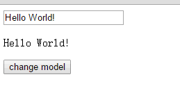

# simple_vue
simple implement vue

```html
<div id="mvvm-app">
    <input type="text" v-model="word">
    <p>{{word}}</p>
    <button v-on:click="sayHi">change model</button>
</div>

<script src="./js/observer.js"></script>
<script src="./js/watcher.js"></script>
<script src="./js/compile.js"></script>
<script src="./js/mvvm.js"></script>
<script>
var vm = new MVVM({
    el: '#mvvm-app',
        data: {
            word: 'Hello World!'
        },
        methods: {
            sayHi: function() {
                this.word = 'Hi, everybody!';
            }
        }
    });
</script>
```


### 几种实现双向绑定的做法
- 发布者-订阅者模式（backbone.js）
一般通过sub, pub的方式实现数据和视图的绑定监听，更新数据方式通常做法是 vm.set('property', value)，这里有篇文章讲的比较详细，有兴趣可点[这里](http://www.html-js.com/article/Study-of-twoway-data-binding-JavaScript-talk-about-JavaScript-every-day)
- 脏值检查（angular.js）
angular.js 是通过脏值检测的方式比对数据是否有变更，来决定是否更新视图，最简单的方式就是通过 setInterval() 定时轮询检测数据变动，当然Google不会这么low，angular只有在指定的事件触发时进入脏值检测，大致如下：
    - DOM事件，譬如用户输入文本，点击按钮等。( ng-click )
    - XHR响应事件 ( $http )
    - 浏览器Location变更事件 ( $location )
    - Timer事件( $timeout , $interval )
    - 执行 $digest() 或 $apply()
- 数据劫持（vue.js）
vue.js 则是采用数据劫持结合发布者-订阅者模式的方式，通过Object.defineProperty()来劫持各个属性的setter，getter，在数据变动时发布消息给订阅者，触发相应的监听回调

### 思路整理
要实现mvvm的双向绑定，就必须要实现以下几点：
1. 实现一个数据监听器Observer，能够对数据对象的所有属性进行监听，如有变动可拿到最新值并通知订阅者
2. 实现一个指令解析器Compile，对每个元素节点的指令进行扫描和解析，根据指令模板替换数据，以及绑定相应的更新函数
3. 实现一个Watcher，作为连接Observer和Compile的桥梁，能够订阅并收到每个属性变动的通知，执行指令绑定的相应回调函数，从而更新视图
4. 4、mvvm入口函数，整合以上三者


#### 实现Observer
#### 实现Compile
#### 实现Watcher
#### 实现MVVM